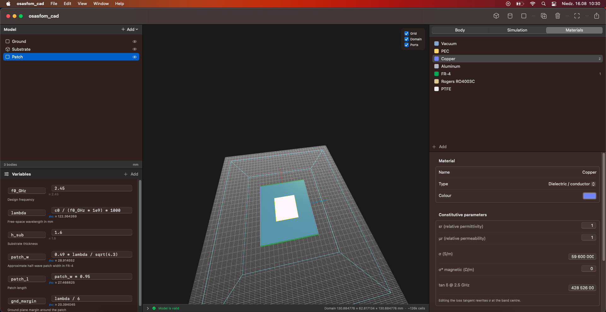
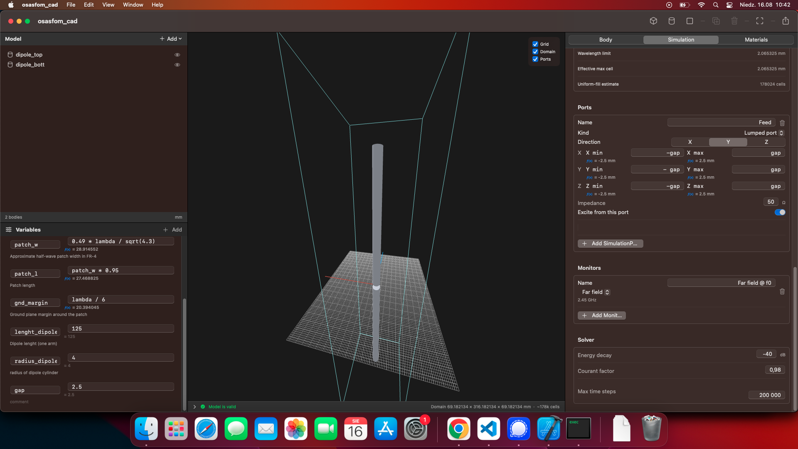
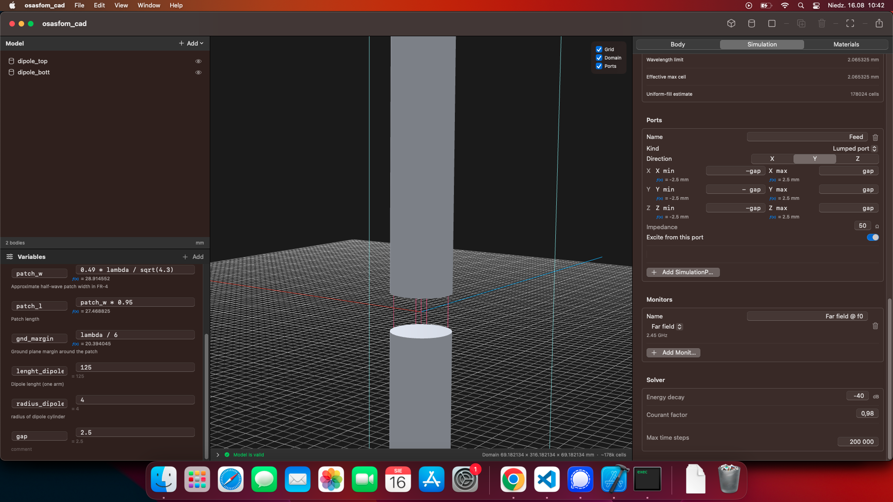

# osasfom_cad

A macOS application for designing antennas and running FDTD electromagnetic
simulations on them — geometry modelling, meshing, solving and post-processing
in one place.

Geometry is **parametric**. Every dimension, position and rotation is an
expression, not a number, so a patch width can be
`lambda0 / 2 * sqrt(2 / (eps_r + 1))` and follow its variables. The project
file stores the source text; the numbers are derived on every edit.

```
f0_GHz   = 2.42
lambda0  = c0 / (f0_GHz * 1e9) * 1000
patch_w  = lambda0 / 2 * sqrt(2 / (eps_r + 1))
patch_l  = lambda0 / 2 / sqrt(eps_eff) - 2 * d_l
```

Change `f0_GHz` and the antenna re-dimensions itself.



<sub>Main window: model tree, parametric viewport, inspector.</sub>

---

## Contents

- [Installing](#installing)
- [Building from source](#building-from-source)
- [A first model in five minutes](#a-first-model-in-five-minutes)
- [Features](#features)
  - [Parametric expressions](#parametric-expressions)
  - [Geometry](#geometry)
  - [Transforms and arrays](#transforms-and-arrays)
  - [STL import and export](#stl-import-and-export)
  - [Materials](#materials)
  - [Simulation setup](#simulation-setup)
  - [Ports](#ports)
  - [Meshing](#meshing)
  - [Running a solve](#running-a-solve)
  - [Results](#results)
  - [Viewport](#viewport)
  - [Files and interchange](#files-and-interchange)
- [Architecture](#architecture)
- [Accuracy: what to trust](#accuracy-what-to-trust)
- [Testing](#testing)
- [Licence and credits](#licence-and-credits)

---

## Installing

**Requirements:** macOS 13 (Ventura) or later. Intel or Apple Silicon — the
shipped build is universal and runs natively on M-series.

Nothing else needs installing. The Swift runtime has been part of macOS since
10.14.4, and AppKit, SwiftUI, SceneKit and Charts are all system frameworks.

Take `osasfom_cad-<version>.dmg` from `dist/`, open it, drag the app to
Applications.

### Gatekeeper

The build is signed **ad-hoc**, not with an Apple Developer ID. On the machine
that built it that is fine. On any other Mac, Gatekeeper will refuse to open it
on the first attempt. Either:

- right-click the app → **Open** → **Open** again, or
- clear the quarantine flag:

```bash
xattr -dr com.apple.quarantine /Applications/osasfom_cad.app
```

Distributing without that step requires a Developer ID certificate and
notarisation (`xcrun notarytool`).

---

## Building from source

```bash
git clone <repository> && cd osasfom_cad
swift build -c release          # library + executable
swift test                      # full test suite
swift run -c release osasfom_cad
```

To produce a distributable `.app`, `.pkg` and `.dmg`:

```bash
./Scripts/build-app.sh                    # universal (arm64 + x86_64), the default
./Scripts/build-app.sh --arm64            # Apple Silicon only
./Scripts/build-app.sh --x86_64           # Intel only
VERSION=1.2.0 ./Scripts/build-app.sh      # stamp a version
```

> `--native` means the *build machine's* architecture, not the target. Run on
> an Intel Mac it produces an Intel-only binary that an M-series Mac will run
> under Rosetta. For native Apple Silicon use the default or `--arm64`.

Verify what you got:

```bash
lipo -archs dist/osasfom_cad.app/Contents/MacOS/osasfom_cad
```

Note that `swift test` runs in debug by default, which makes the end-to-end
FDTD tests punishingly slow. Use `swift test -c release` — the full suite drops
from tens of minutes to about two.

---

## A first model in five minutes

1. **New project.** Set the length unit (mm by default) in the Body inspector.
2. **Variables.** Open the variables panel and add `f0_GHz = 2.42`, then
   `lambda0 = c0 / (f0_GHz * 1e9) * 1000`. `c0`, `pi`, `eps0`, `mu0` and `z0`
   are built in.
3. **Geometry.** Model ▸ **+** ▸ Box / Cylinder / Sheet. Type expressions into
   the dimension fields, not numbers.
4. **Material.** Materials tab — assign PEC to the metal, a dielectric to the
   substrate.
5. **Port.** Simulation tab ▸ Ports ▸ Add lumped port. Type the terminal
   coordinates, or use the pick button and click a body face in the viewport.
6. **Frequency and domain.** Simulation tab — set the sweep range; leave the
   domain on Automatic.
7. **Mesh.** Tick **Mesh** in the viewport legend to see the grid the solver
   will use, and the real cell count.
8. **Run.** Run tab ▸ Run. Watch the progress and the live energy-decay figure.
9. **Results.** S11 chart and table, far-field pattern if enabled, and the run
   is kept in the history so the next one can be compared against it.

---

## Features

### Parametric expressions

Every numeric field in the app accepts an expression.

**Constants:** `pi`, `tau`, `e`, `c0` (m/s), `eps0`, `mu0`, `z0`.

**Functions:** `abs`, `sqrt`, `cbrt`, `exp`, `log`, `ln`, `log10`, `log2`,
`sin`, `cos`, `tan`, `asin`, `acos`, `atan`, `sinh`, `cosh`, `tanh`,
`sind`, `cosd`, `tand` (degree variants), `floor`, `ceil`, `round`, `sign`,
`deg`, `rad`, `atan2`, `pow`, `hypot`, `mod`, `min`, `max`, `clamp`, `lerp`.

Variables may reference other variables. Circular references, unknown names
and syntax errors are reported as diagnostics against the field that caused
them rather than failing the whole model.

### Geometry

**Primitives**

| Primitive | Defined by |
|---|---|
| Box | absolute begin/end on each axis |
| Cylinder | radius, begin/end along a chosen axis |
| Sheet | width, depth, and begin/end along its normal — **zero thickness is legal** |
| Mesh | an imported STL triangle soup |

A zero-thickness sheet is the right way to model PCB metal: it costs no cells,
and the solver imposes it as a perfect-conductor boundary condition on the grid
edges lying in its plane rather than trying to average a surface over cell
volumes. That holds for PEC and for any material that conducts like one across
the band — Copper and Aluminium do, with σ/ωε far above 10⁵. A zero-thickness
sheet of anything else has no volume to fill, so it is left out of the
simulation and the run says so.

**Booleans.** Each body carries an ordered history of Add (union), Subtract
(difference) and Trim (intersection) steps, each with its own primitive and
placement. The history is editable after the fact — steps can be disabled,
reordered or removed. Booleans are evaluated analytically for the physics and
by BSP CSG for display, so the viewport and the solver cannot disagree.

**Placement.** Position, rotation (Euler, XYZ) and scale, all parametric.
Negative scale mirrors, and triangle winding is corrected so lighting stays
right.

**Priority.** Where bodies overlap, the higher priority wins; ties break by
list order. This is what lets a trace sit on top of a substrate.

### Transforms and arrays

Right-click a body (or a multi-selection) → **Transform…**

- **Translate** by an X/Y/Z offset
- **Rotate** about X, Y or Z, by an angle, through a centre point
- **Mirror** through a plane normal to X, Y or Z
- **Copy**, with a repetition count — copy *k* gets the transform applied *k*
  times, so a 20 mm offset with three copies lands them at 20, 40 and 60 mm

Translation composes **symbolically**: `s_dip` becomes `s_dip + 3 * (spacing)`,
so an array built on a variable still follows it. Rotation and mirroring need
the body's current orientation as a matrix and therefore resolve to literals;
the dialog warns before it flattens a parametric placement.

A mirror is capped at one copy — mirroring twice returns a body to where it
started. The whole operation, however many bodies and copies, is one undo step.

### STL import and export

**File ▸ Import STL… (⌘I).** Both ASCII and binary are read. The flavour is
decided by arithmetic (a binary file is exactly `80 + 4 + 50·count` bytes), not
by looking for the word `solid`, which plenty of binary writers put in their
header.

STL carries no units, so the open panel asks which unit the file is in and
converts into the project's. The mesh is recentred on its bounding box and the
offset becomes the body's position, so it lands where the file put it while
still obeying the centred-on-origin convention every primitive uses.

An imported mesh is a **first-class body**: it meshes, voxelises, takes part in
booleans and simulates. Point-in-solid uses a BVH-accelerated ray-parity test
(~600 ns at 49 k triangles), because the FDTD material provider samples
containment tens of millions of times while building the operator. Meshes are
checked for watertightness; an open one falls back to a majority-of-three-rays
vote and the inspector says so.

**File ▸ Export STL… (⇧⌘E)** writes all visible geometry as binary STL in the
project's unit.

### Materials

Built-in library: **Vacuum**, **PEC**, **Copper**, **Aluminum**, **FR-4**,
**Rogers RO4003C**, **PTFE**. Custom materials can be added with:

- relative permittivity and permeability
- electric and magnetic conductivity
- a kind: dielectric/conductor, perfect electric conductor, perfect magnetic
  conductor
- dispersion: none, Debye (multi-pole), Drude, or Lorentz (multi-pole)
- a display colour with transparency

Only materials actually assigned to a visible body influence the mesh, so an
unused high-permittivity entry in the library does not silently shrink every
cell in the model.

### Simulation setup

**Domain** — Automatic (model bounds plus padding), From frequency (padding
derived from the wavelength), or Manual bounds. Padding is itself parametric,
so `lambda0/2` works.

**Boundaries** — per face: PML (graded absorbing layer), Electric wall (PEC),
Magnetic wall (PMC), Periodic. PML cell count is configurable. Walls sit
exactly on the domain's outermost grid line, and an absorbing layer is backed
by an electric wall. A magnetic wall is an exact symmetry plane: half a model
closed by one rings at the same frequency as the whole.

> **Periodic is not implemented.** Selecting it simulates the face as an
> electric wall, and the model reports a warning. Use Electric/Magnetic walls
> for symmetry-plane and broadside unit-cell work.

**Frequency** — minimum and maximum of the swept band.

**Excitation** — Gaussian pulse (broadband, the usual choice), sinusoidal
(steady state), or step with a smooth rise.

**Solver** — energy-decay end criterion in dB, maximum time steps, Courant
factor.

**Monitors** — named regions or planes for E-field, H-field, current density,
power flow or far field at chosen frequencies.

> **Monitors are not yet recorded.** They can be defined, saved and exported in
> the solver deck, but the FDTD run ignores them — nothing is captured and no
> field data comes back. Far-field patterns come from the separate
> near-to-far-field surface, which *is* implemented, and are unaffected.

### Ports

**Lumped port.** A two-terminal element across a gap: a series resistance at
the reference impedance plus a soft voltage source. Terminals are given as
coordinates, or picked by clicking a body face in the viewport. The port spans
**every** Yee edge between its terminals, sharing the reference impedance and
the source voltage between them by edge length, so a gap wider than one cell is
modelled as the series chain it is.

**Waveguide port.** A TE*m*₀ mode imposed over a rectangular cross-section. The
broad wall is taken from the rectangle, so a port drawn either way up still
excites the fundamental. Cutoff and the dispersive modal wave impedance
`η/√(1−(f_c/f)²)` follow from the geometry and the medium filling it, both
sampled rather than assumed. The inspector shows the live cutoff frequency and
warns when the swept band sits below it; a run whose whole band is below cutoff
is refused with the number.

The region's depth along the propagation axis is the **de-embedding distance**:
the source sits on the launch face and the probe on the far one, because
measuring where you inject cannot separate the source's own backward wave from
a reflection.

Ports may be excited or passive; passive ports are still recorded.

### Meshing

A non-uniform Yee grid built from:

- **Cells per wavelength** at the highest frequency in the densest material
- **Max / min cell size** overrides
- **Snap to body faces** — grid lines pinned to every body and boolean-tool
  face, so a cut lands where the numbers say
- **Fixed lines** per axis, for resolving a thin layer
- **Refinement regions** with their own target cell size
- **Max growth ratio** — cell size ramps geometrically between regions instead
  of stepping, which is what the Yee coefficients are least forgiving of

Grid lines are pinned at port terminals automatically.

### Running a solve

The Run tab starts and stops a simulation and shows live progress, grid size
and the residual energy in dB.

A run ends on whichever comes first:

- **Energy decay** — residual field energy falls the requested number of dB
  below its peak. This is the convergence criterion: the S-parameter DFT
  assumes the fields have rung down, and a truncated time series produces
  spectral leakage.
- **Maximum time steps** — reported as *not* converged, with the shortfall
  spelled out, because a spectrum from a still-ringing structure looks
  plausible and is not.
- **Stop**, which still yields a (less converged) spectrum from what was
  recorded.

The criterion waits out the excitation before it can fire, and stands down
entirely for a source that never stops driving (sinusoidal, step), where energy
plateaus instead of decaying.

The volume update is multithreaded across CPU cores.

### Results

**Return loss** — S11 magnitude in dB and phase across the swept band, as a
chart or a table. The plotted sub-range can be narrowed after the fact without
re-simulating, since the DFT can be evaluated at any frequency from the
recorded time series (clamped to the band actually excited).

**Far field** — 3D radiation pattern overlaid on the model, plus principal-plane
cuts. Quantities: directivity, realized gain (folding in loss and mismatch), or
normalized. Derived figures include beamwidth, front-to-back ratio and
efficiency.

**Run history** — every run is stored with a snapshot of the variable values it
used, which is what makes two runs comparable. The comparison view labels runs
by whichever variables differ between them and reports the shift in the deepest
dip.

**Export** — **File ▸ Export Return Loss… (⇧⌘R)** writes CSV or Touchstone
(`.s1p`, read by every VNA and simulator).

### Viewport

SceneKit, rendered on demand. Orbit, pan and zoom; ⌘0 zooms to fit. Framing is
explicit, so an edit never moves the camera.

Toggles in the legend:

- **Grid** — reference floor grid
- **Domain** — the simulation bounding box
- **Ports** — lumped ports as a tube with distinctly coloured terminals;
  waveguide ports as a box with a direction arrow
- **Mesh** — the actual Yee grid, sliced on three orthogonal planes through the
  model, with the real cell count. Drawing the full lattice would be unreadable
  and slow; three slices cost `2·(nx+ny+nz)` segments instead of `nx·ny·nz`
- **Far field** — the pattern, with an opacity slider

Click to select, shift/⌘-click to extend. Selection is shared with the model
list. Face picking sets port terminals by clicking geometry.



<sub>A half-wave dipole, with the simulation domain and reference grid.</sub>



<sub>A lumped port across a dipole's feed gap. The tube spans the terminals;
red marks <em>begin</em>, blue <em>end</em>, since voltage is integrated
begin → end.</sub>

### Files and interchange

| Format | Direction | Purpose |
|---|---|---|
| `.osasfomcad` | read/write | The project. JSON, expressions preserved verbatim |
| v1 prototype JSON | read | Auto-upgraded on open |
| STL (ASCII + binary) | read/write | Geometry interchange |
| Solver deck (JSON) | write | Fully resolved SI setup, for an external solver |
| CSV | write | S11 sweep |
| Touchstone `.s1p` | write | S-parameters with phase |

The project file and the solver deck are deliberately different documents: the
project stores **expressions** and is the editable source; the deck stores
**resolved metres** and is a one-way export.

---

## Architecture

Four targets, layered so the model can be driven without a UI.

```text
osasfom_cad          SwiftUI app — views, menus, panels
   │
   ├── osasfom_cadRender    SceneKit scene controller
   │        └── osasfom_cadCore
   ├── osasfom_cadSolver    FDTD engine + CAD bridge
   │        └── osasfom_cadCore
   └── osasfom_cadCore      headless model layer — Foundation only
```

```text
Sources
├── osasfom_cadCore          9 000 lines — no AppKit, no SceneKit
│   ├── Geometry/            Vec3, Axis, Matrix3, BodyBounds, TriangleMesh (+BVH),
│   │                        MeshCSG, ShapeContainment, BodySnapPoint
│   ├── Expressions/         lexer, parser, evaluator, builtins, aggregates
│   ├── Model/               primitives, bodies, transforms, variables,
│   │                        materials, booleans, units
│   ├── Simulation/          domain, boundaries, mesh, ports, monitors, solver
│   ├── Resolve/             expressions → resolved geometry + diagnostics
│   ├── IO/                  project file, legacy import, STL in/out, solver deck
│   └── Document/            document, snapshot undo, recent projects
├── osasfom_cadRender        1 100 lines — scene reconciliation, geometry factory
├── osasfom_cadSolver        4 600 lines — Yee engine, mesher, ports, far field
└── osasfom_cad              5 800 lines — SwiftUI
```

**The pipeline.**

```
CADModelState  (expressions, the editable truth)
      │  ModelResolver
      ▼
ResolvedModel  (numbers + diagnostics)
      │  GridMesher              → Yee grid lines, metres
      │  CADMaterialProvider     → ε, µ, κ, σ at a point
      ▼
Operator.calcECOperator()        → per-edge update coefficients
      │  Engine.make(op:)
      ▼
engine.iterateTS(n)              → volt / curr marched in leapfrog
      │  EngineExtension hooks   → ports, far-field surface DFT
      ▼
PortSpectrum (DFT) → S11, Zin;  NearFieldToFarField → patterns
```

**Key design decisions**

*Expressions are the model.* `CADModelState` holds source text.
`ModelResolver` turns it into a `ResolvedModel` of plain numbers plus
diagnostics attached to the field that caused them. Nothing downstream sees an
expression.

*One authority for geometry.* `ShapeContainment` answers "is this point inside
this body", booleans included, analytically. The FDTD material lookup samples
it, and `BodyMesh` builds display triangles from the same shapes, so the
viewport and the physics cannot drift apart.

*Core is headless.* Foundation only. It can be driven from a command-line
mesher or harness, and it is where most of the tests live.

*The solver is a real port.* `osasfom_cadSolver` is a Swift port of openEMS's
Yee-grid `Engine`/`Operator` core, plus a bridge that meshes a `ResolvedModel`
and drives it. Ports and the far-field recorder are `EngineExtension`s, the
same seam openEMS uses.

*Undo is snapshot-based.* Each edit pushes a document snapshot; keystrokes in
one field coalesce into a single step via a coalescing key.

---

## Accuracy: what to trust

Honest notes on where the numbers are solid and where they are not.

**Reliable.** Mesh generation and snapping; the expression system; boolean
geometry; point-in-solid, including imported meshes; resonant frequency and
S11 shape for well-meshed models; mode geometry, cutoff and dispersion for
waveguide ports; passivity (|S11| ≤ 0 dB is enforced by construction and
tested).

**Known limitations.**

*The absorbing boundary is a matched lossy layer, not a split-field PML.* It is
reflectionless at normal incidence and degrades at oblique. Measured on a WR-90
guide, it rings down about 5× faster than a shorting wall — good, not perfect.
Consequences: absolute |S11| from a waveguide port reads several dB high, and
far-field patterns carry some boundary reflection. Resonant *frequencies* are
much less affected than absolute magnitudes.

*Periodic boundaries are not implemented* — a face set to Periodic is
simulated as an electric wall, and the model warns about it.

*Field monitors are not recorded* — they exist in the model and the exported
deck, but the solver does not sample them.

*PEC is a large finite conductivity plus a hard-boundary pass.* Edges whose
material loss exceeds what the update can represent are forced to zero, which
is the correct limit; zero-thickness sheets of PEC or of a metal (σ/ωε ≥ 10⁵ at
the top of the band) are imposed directly as a boundary condition.

*Numeric transforms quantise to `%.6f`* — a micrometre in a millimetre project
— because placements round-trip through expression text. This is why
translation composes symbolically instead of resolving.

**Scale.** A monolithic run is practical into the low millions of cells. Beyond
that, memory (≈144 B/cell for the stepping arrays, plus setup scratch) and time
become the limit. Large arrays should be handled by unit-cell analysis with
electric/magnetic symmetry walls rather than brute force.

---

## Testing

```bash
swift test -c release
```

Roughly 300 tests across the three test targets, about 6 000 lines — a third of
the source. The bias is deliberate: in a solver, a wrong answer looks exactly
like a right one, so tests assert physical invariants rather than return
values. Examples that have each caught a real bug:

- an imported STL box must voxelise identically to a declared box of the same
  size, across thousands of sample points
- containment must not change with tessellation density
- a passive port can never reflect more power than it receives
- BVH query cost must not scale with triangle count
- a stricter energy-decay target can never be reached sooner than a looser one
- mirroring a body twice must return it exactly where it started

---

## Licence and credits

**GPLv3** — see [LICENSE](LICENSE).

This project builds on existing open-source work:

- [openEMS](https://github.com/thliebig/openEMS) — the FDTD `Engine`/`Operator`
  core is a Swift port of openEMS's, and the reference for port and excitation
  behaviour.
- [CSXCAD](https://github.com/thliebig/CSXCAD) — reference for geometry and
  mesh handling; the CAD layer here replaces it.

Antenna design formulas follow Balanis, *Antenna Theory: Analysis and Design*,
chapter 14 (rectangular microstrip patch), cited by equation number in the
example projects.
